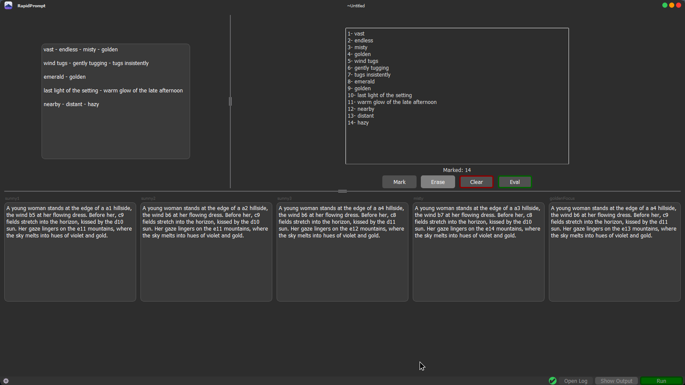

# RapidPrompt

RapidPrompt is a GUI Prompt Distributer to fast and reliably distribute prompts for Loras or other scenarios where only details in many prompt windows have to be changed.  
*Note: This is a Windows program that is untested but should work on Linux.*



## Features

- **Keyword Input:**  
  Input a variety of keywords that will appear in the outputs.  
- **Grouping & Insertion Points:**  
  Mark which inputs should be grouped or left separate.  
  Set insertion points in your outputs using a lowercase letter combined with a number (e.g., `[a1]` or `[x1]`). The number determines which keyword will be inserted, while the letter serves only for your own orientation.  
- **Custom Headers:**  
  Assign each output with a unique header to distinguish them.  
- **Output Copying:**  
  Run the program and simply click into the output field to copy the results.  
- **Layout Export/Import:**  
  Export the current layout—including output texts and headers—for reuse later, making it easy to swap in different Loras or configurations.

[Check Gallery for quick working overview](./gallery/01InputThenMark.png)

## Installation

### Windows

- Head to the release page and download the executable (.exe) file.
- Alternatively, refer to the Linux installation instructions below if you prefer to execute or build the program yourself.

### Linux

1. **Clone the Repository:**
```
git clone https://github.com/cpAigis0/RapidPrompt.git
cd RapidPrompt
```

2. **Set Up a Virtual Environment (Recommended):**
```
python3 -m venv venv
source venv/bin/activate  # On Windows use: venv\Scripts\activate
```

3. **Install the Dependencies:**
```
pip install -r requirements.txt
```

4. **Run the Script:**
```
python rapidprompt.py
```

## Contributing

I don't plan on updating the project actively, but if you'd like to contribute, feel free to help improve it! The usual process applies:

- **Fork the Repository:**  
  Create your own fork to work on improvements.

- **Create a Branch:**  
  Develop your feature or fix in a separate branch.

- **Submit a Pull Request:**  
  Once you're happy with your changes, submit a pull request. Please ensure your code follows the project's style and includes appropriate tests if applicable.

- **Report Issues:**  
  If you find bugs or have suggestions, please open an issue to discuss the matter.

Your contributions are welcome!

## License

This project is licensed under the MIT License.

## Disclaimer

By using this program, you acknowledge and agree that I, as the creator, am not responsible for how the program is used or any consequences arising from its use. Any modifications or further uses of this program are solely your responsibility. Use at your own risk.
